# Creditas Data Engineering Challenge


## The Problem: digital media effectiveness
https://github.com/Creditas/challenge/tree/master/data-engineering
<br />

## The solve problem: digital media effectiveness

In summary, my analysis should answer the 4 questions as described below:
1. What was the most expensive campaign?
2. What was the most profitable campaign?
3. Which ad creative is the most effective in terms of clicks?
4. Which ad creative is the most effective in terms of generating leads?

<br />

### Docker Preparation:

**Jupyter + Spark:**

1 - Download: [Here](https://drive.google.com/file/d/11Czp83ZIxME5UPmFiY99KusyXj9OCztZ/view?usp=sharing)

2 - Create dns network:
```bash
$ sudo docker network create ponte
```

3 - After download completed, go to load docker image.
```bash
$ sudo docker image load -i "your download directory"/jupyter_spark_murillo.tar.gz
```

4 - Entry in clone project and then run the command below to start an image with jupyter / spark.

```bash
$ sudo docker run --rm -p 10000:8888 --net=ponte --user root -e JUPYTER_ENABLE_LAB=yes -e GRANT_SUDO=yes -v "$PWD":/home/jovyan/work jupyter/spark
```

Obs:
* It necessary to enter into project cloned for better navigation.
* It will necessary inserts the generate key, as the sample image below:

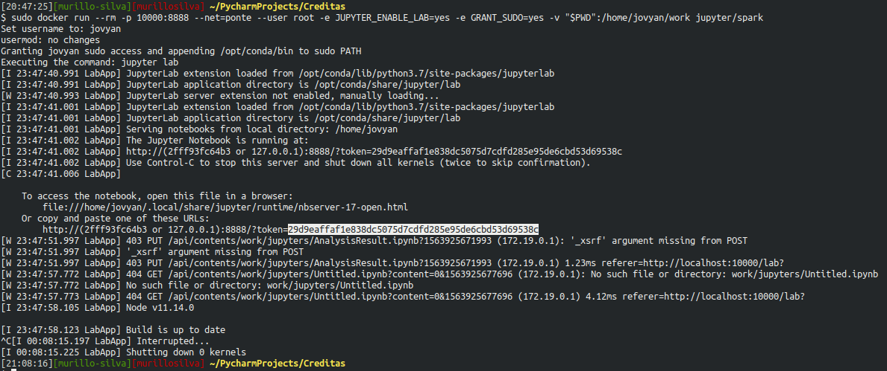
<br />
<br />
<br />
**Mysql:**

1 - Download: [Here](https://drive.google.com/file/d/1XVrRszyH42gx0hoM-6seIuhPkDPoONs0/view?usp=sharing)

2 - After download completed, go to load docker image.
```bash
$ sudo docker image load -i "your download directory"/mysql.tar.gz
```

3 - Run Docker
```bash
$ sudo docker run --name=mysql_murillo --net=ponte -v "clone project diretory"/mysql:/var/lib/mysql -e MYSQL_ROOT_PASSWORD=password -d mysql/mysql-server
```

4 - Exec Docker
```bash
$ sudo docker exec -it mysql_murillo mysql -uroot -p"$MYSQL_ROOT_PASSWORD"
```
Obs: Maybe, it will going to insert the password, if went requested, please inform the pass `password`


After load, run e exec. Its possible acess the mysql database and see all objects, such as Schema=`creditas` and all tables(`customer_lead_funnel`,`facebook_ads`,`google_ads`,`pageviews`) and own registers, as image below:

<br />
<br />
<br />
**Notebook Analysis:**

Brief explanation.
* Into folder jupyter, your can find the archive `AnalisysResult.ipynb`, all the explorations went realized into, as well all the processing and anwers of the questions.

* The analysis went divided in:
    - Read original files.
    - Structuring dataframes.
    - Save dataframes in parquets (Raw and Refined visions).
    - Save dataframe em Mysql Database.

Detailed explanations:

Data exploration and structuring work has been done, which can be followed in detail by accessing the jupyter `AnalisysResult.ipynb`. After exploring data, context-specific dataframes were created, after structuring the data without filters was saved in the `Raw` directory within this project.

The following is a view of the `Raw` structure of the data.
<br />
<br />
<br />
1 - Structure Process.

1.1 -Post structure datadrame Google:
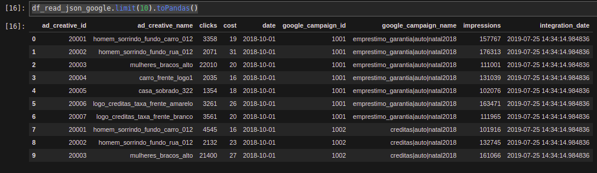

1.2 - Post structure datadrame Facebook:
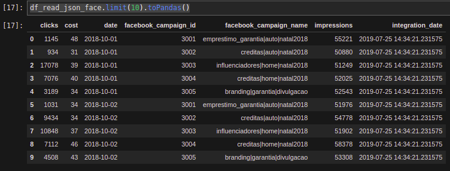

1.3 - Post structure datadrame Pageviwes:
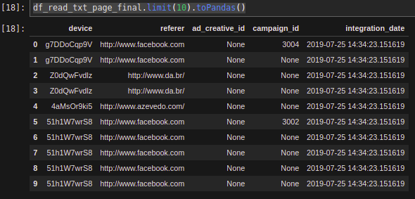

1.4 - Post structure datadrame Customer Lead Funnel:
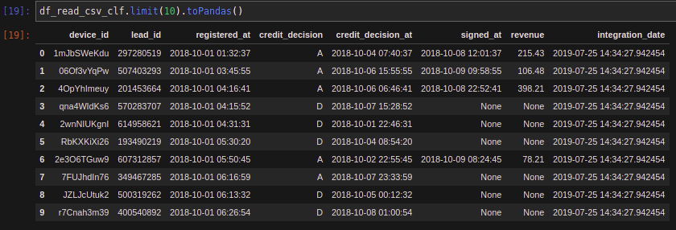

After data saved in `Raw` was persisted in a MySql Local database (docker), being possible to access them through DataViz tools.
<br />
<br />
<br />
2 - Persist Process.

2.1 - google_ads Table.
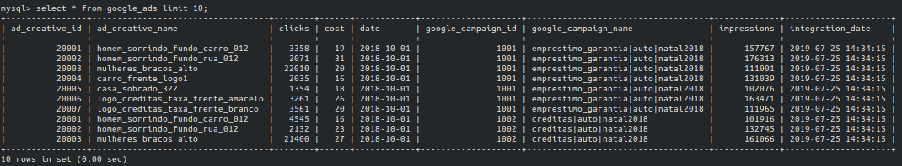

2.2 - facebook_ads Table.
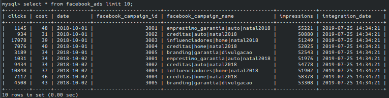

2.3 - pageviews Table.<br />
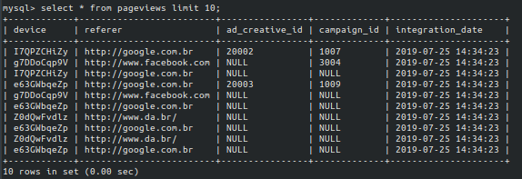

2.4 - customer_lead_funnel Table.
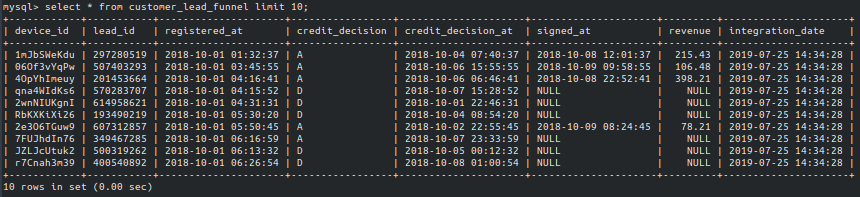

obs: Both registers can be consulting in MySql Docker Database.
<br />
<br />
<br />
3 - Create and save visions in refined zone.

3.1 - Most Expensive Vision.<br />
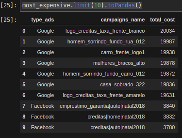

3.2 - Most Profitable Vision.<br />
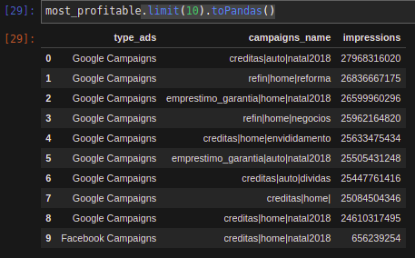

3.3 - Most Effective Clicks<br />
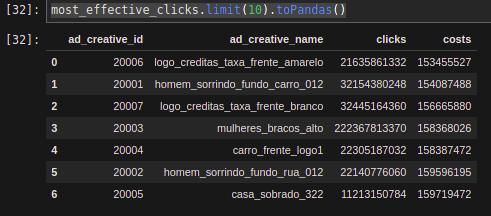

3.4 - Most Effective Leads<br />
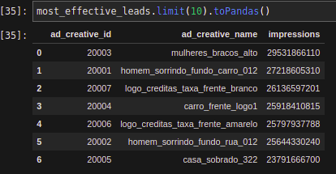

3.5 - Save in parquets in Refined.
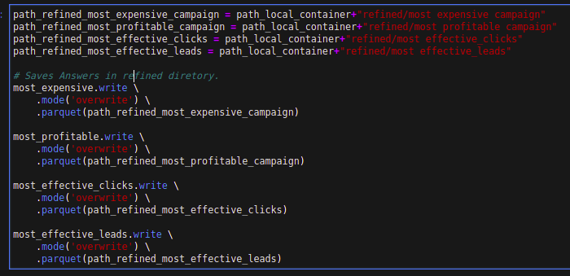


### Conclusion.

The entire process was performed locally as well as processing and persistence using docker images. As we know there are several ways to propose a solution to a problem, I tried to think of a simpler one.

The process can be streamlined by running on some cloud service (Dataproc, EMR, Hortonworks, Cloudera and whatever) and scheduling via Airflow.


